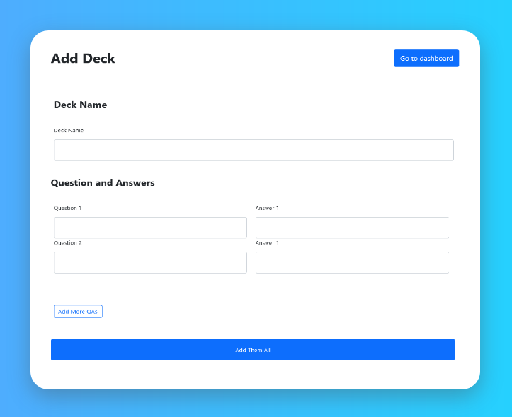
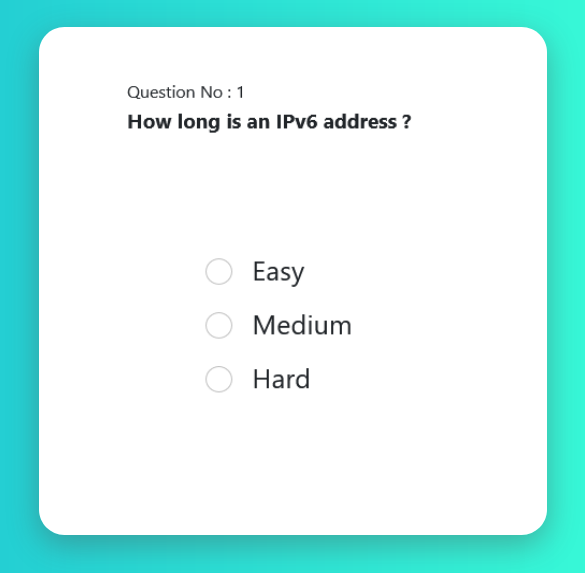
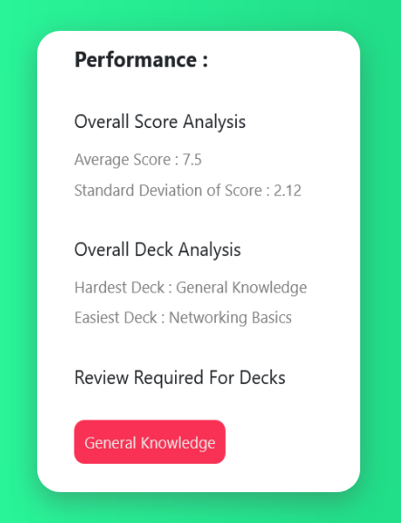
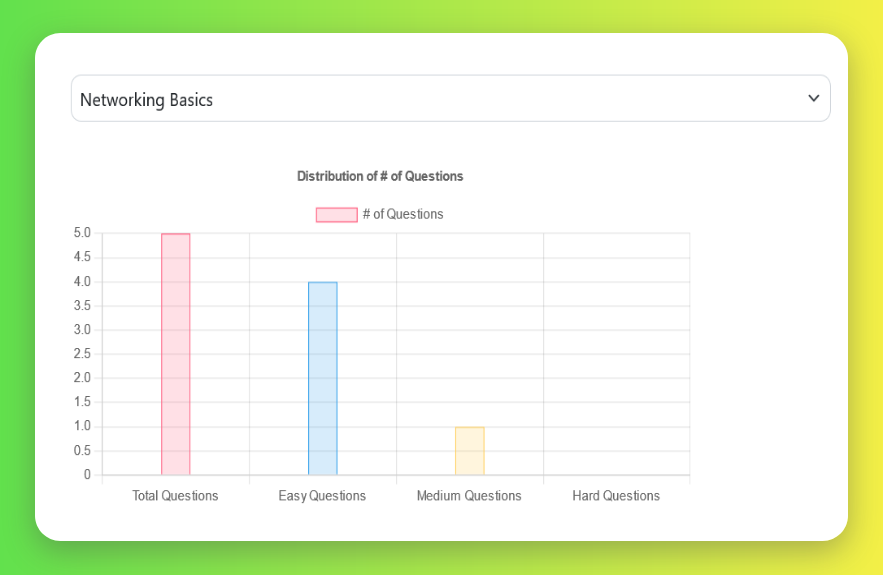
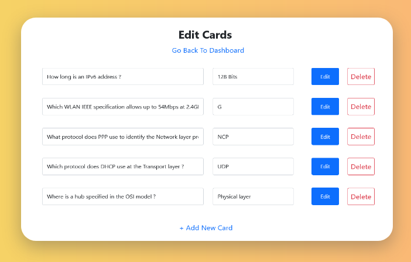

# Brainstorm App

This is a flashcard application that will help you remember 
important things quikly. For a demo, [click here](https://vishvam-madfinalprojectdemo.vishvam-sundara.repl.co/)

## Tech Stack

**Client:** HTML, CSS, Bootstrap 5.0, JavaScript, Chart.js
**Server:** Flask
**API:** Flask-RESTful

## Basic setup

Clone the project
```bash
  git clone 
```

Go to the project directory
```bash
  cd my-project
```

Create a virtual environment in the project folder

```bash
  python3 -m venv /path/to/new/virtual/environment
```

Install the dependencies using pip
```bash
  pip install - r requirements.txt
```

Run the development server 
```bash
  python main.py
```

## API Documentation

The API follows an OpenAPI 3.0.0 standard. [Click Here](./openapi.yaml) to view the full documentation in the YAML format. Paste it in Swagger Editor or any other OpenAPI tool to get a friendly-view

## Features

- User Login
- Personal Dashboard
- Deck Management
- Card Management
- Graphical Analysis
- Revision Recommendations
- Cross Platform
- Subtle and Clicky Animations

## Screenshots





